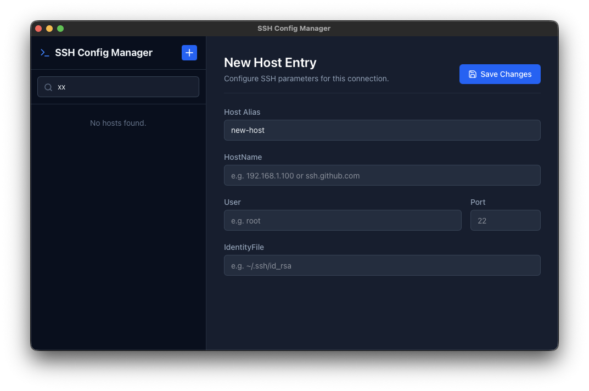

# 🖥️ SSH Config Manager

An elegant, developer-first desktop application built with **Tauri**, **React**, **TypeScript**, and **Tailwind CSS v4** to visually manage your local `~/.ssh/config` file.



## ✨ Features

- **Safe Configuration Parser**: Modifies Host entries dynamically *without* destroying existing standalone comments or global configurations.
- **Auto-Backup System**: Creates an automatic `.bak` copy of your configs before mutating the actual config file.
- **Platform Agnostic UI**: Beautifully crafted dark mode layout targeting macOS, Linux, and Windows desktop aesthetics seamlessly.
- **Fast Search**: Instant, un-debounced filtering functionality to cycle through massive clusters of stored servers.
- **Lightweight**: Ships to minuscule bundle sizes, utilizing Rust's native file system APIs directly.

## 🚀 Getting Started

### Quick Download (No Build Required)

You don't need to install any development tools to use this application! Simply download the compiled executable:
1. Go to the **[Releases](../../releases)** page on this repository.
2. Under the **Assets** section of the latest release, download the file tailored for your OS (e.g., `.dmg`/`.app` for macOS, `.exe` for Windows, `.deb` for Linux).
3. Open the downloaded file and enjoy!

### For Developers (Build from Source)

You need standard Node package utilities and the Rust toolchain installed:
1. [Node.js](https://nodejs.org) (v18+)
2. [Rust / Cargo](https://www.rust-lang.org/tools/install)

### Setup

```bash
# 1. Clone the repo
git clone https://github.com/your-username/ssh-config-manager.git
cd ssh-config-manager

# 2. Install Javascript dependencies
npm install

# 3. Fire up the development environment
npm run tauri dev
```

### Build for Production

To compile this desktop wrapper into a native binary (`.app`/`.exe`/`.deb` etc.):
```bash
npm run tauri build
```

The resulting binaries will be placed in `src-tauri/target/release/bundle/`.

## 🤝 Contributing

We welcome pull requests! Please ensure you:
1. Use **Conventional Commits** for branching and commit messages. 
2. Follow **SemVer** definitions.

See logic conventions in the `src-tauri/src/` bindings before making substantial IO changes.

## 📄 License
This project operates under the **MIT License**. Check the `LICENSE` file for more details.
